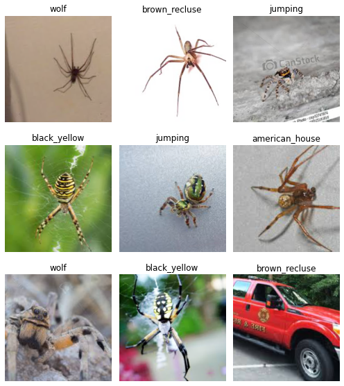
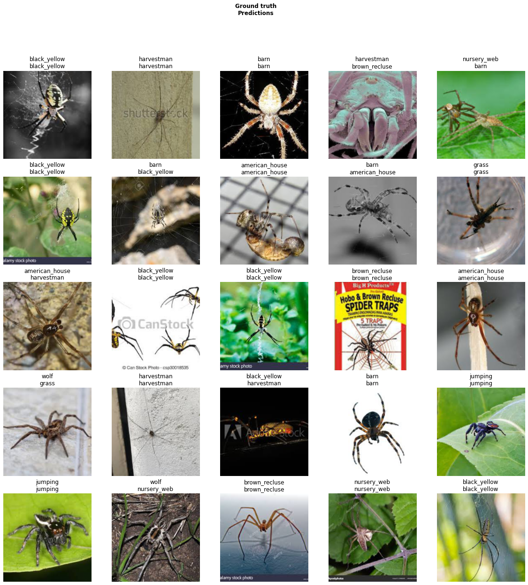
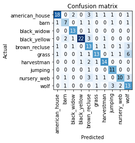

# tj-machine-learning
This repository contains some of my machine learning projects in Jupyter Notebook classifying the MNIST (handwritten digits) dataset originating from ML researcher Yann Lecun. I used different ML techniques to do this task such as Convolutional Neural Networks (CNNs), Logistic Regression, and Support Vector Machines (SVMs). To implement these models, I imported Tensorflow, Keras, and Scikit-Learn libraries, and ran grid parameter tests to solve for the optimal parameters.

Additionally, as a side project, I used a Fast.ai library and its functionalities to pull spider images from Google Images, assign labels, and classify the spiders with a CNN model. I also added an ImageCleaner to filter out irrelevant pictures from the data. The resulting accuracy was around ~80%.

## Train Set Images + Labels:

As you can see, some of the spiders have good images, but the bottom right has an irrelevant picture.

## Classified Images + True & Assigned Labels:

The classified spiders are mostly right but a few are misclassified due to a lack of training data and faulty data.

### Confusion Matrix:

There are patterns of which spiders my model confuses such as the grass and wolf spiders. These spiders are similar in features which is likely why.
